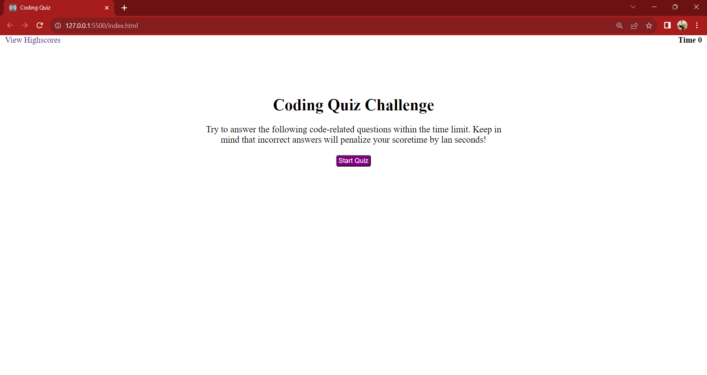

# Coding Quiz

### Description
This coding quiz project was a little fun project to challenge myself and practice traversing through the DOM, utilizing localstorage, and utilizing Web Aplication Programming Interfaces (API's) in Javascript.

- I was motivated to do this project to better my skills, and create my own experience using those tools.

## Technologies Used
- HTML
- CSS
- JavaScript

Deployed Site: https://batking74.github.io/Coding-Quiz/

GitHub Repo: https://github.com/Batking74/Coding-Quiz
